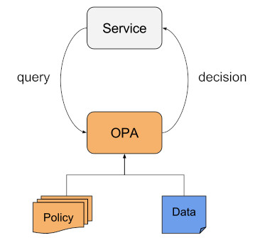
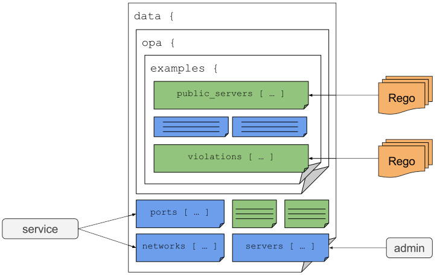

# Introduction

## First of All, Why?

- As a developer, you want to outsource policy decisions.
- As a security/compliance professional, you don't want your policy to be implemented over and over again in disparate ways.
- As a security/compliance professional, you want to manage policies centrally in an uniform way.

## What is A Policy?

In an informal way a policy encodes knowledge about how to comply with legal requirements, work within technical constraints, avoid repeating mistakes, and so on.

In a formal way as used by OPA, a policy is a function `f:X -> Y`.
It takes a value and outputs another value of arbitrary types.
Especially, input and output may be structured documents.
It does not have any side effects.
According to this definition, the following examples are policies:

- Authenticated users from the real "Fairyland" may access the service.
- Authenticated users may open 8 parallel connections, non-authenticated users just 1.
- Between 7 p.m. and 6 a.m., only admins from the "active-duty" group may access the system

Action can be taken on the result of a policy evaluation, but the action is entirely decoupled.

This differs from the established concept of "business rules" as implemented by common business rules engines such as [Drools](https://www.drools.org/).
Here, a rule has the form: `when CONDITION then ACTION`. This concept is problematic
because it binds a decision to the  implementation of action, rendering the rule meaningless without the actual implementation.

## What is OPA?

OPA is a lightweight general-purpose policy engine that can be co-located with your service. You can integrate OPA as a sidecar, host-level daemon, or library.

Services offload policy decisions to OPA by executing queries. OPA evaluates policies and data to produce query results (which are sent back to the client). Policies are written in a high-level declarative language and can be loaded into OPA via the filesystem or well-defined APIs.

## How does OPA work?

### The Query-Decision Pattern



-- Source: OPA Documentation

### The OPA Data Model

All documents pushed into OPA or computed by rules are nested under a built-in root document named data.



-- Source: OPA Documentation

Example `data` document:

```json
{
  "servers": [...],
  "ports": [...],
  "networks": [...],
  "opa": {
    "examples": {
      "violations": [...],
      "public_servers": [...]
    }
  }
}
```

As a result, any document, base or virtual, can be accessed hierarchically starting from the root data node – either as an identifier:

```ruby
import data.servers                            # Base document
import data.opa.examples.violations            # Virtual document
```

or as a URI component in an HTTP request:

```http
GET https://example.com/v1/data/servers HTTP/1.1
```

```http
GET https://example.com/v1/data/opa/examples/violations HTTP/1.1
```

### The `input` Document

In some cases, policies require input values. In addition to the built-in
`data` document, OPA also has a built-in `input` document. When you query
OPA, you can set the value of the `input` document.

Example `input` document:

```json
{
    "method": "GET",
    "path": "/servers/s2",
    "user": "alice"
}
```

The `input` document can be referenced just like the `data` document.

```ruby
# Let 'bob' perform read-only operations.
allow {
  input.user = "bob"
  input.method = "GET"
}

# Let 'alice' perform any operation.
allow {
  input.user = "alice"
}
```

## Sources

- [github.com/open-policy-agent/opa](https://github.com/open-policy-agent/opa)
